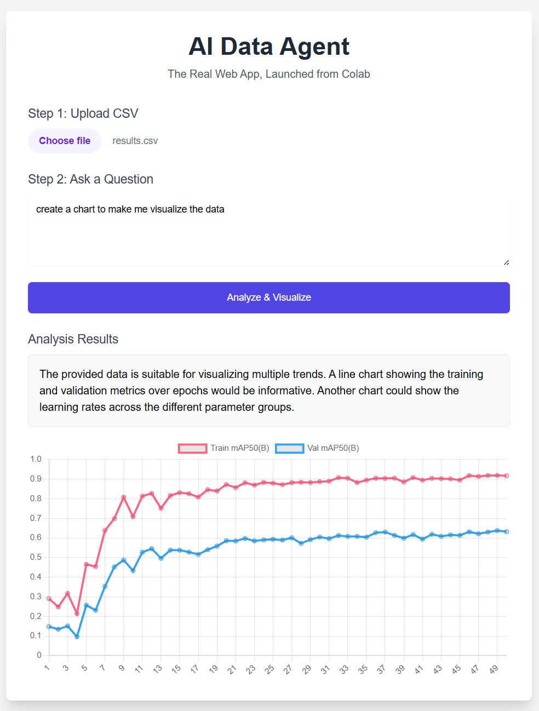

# 📊 Chartify AI Agent

**Turn your raw data into beautiful, insightful visualizations just by asking.**

Chartify AI is a web-based data agent that leverages the power of Google's Gemini 1.5 Flash model to analyze your uploaded CSV files. You can ask complex questions in natural language, and the agent will provide text-based insights and generate dynamic, interactive charts on the fly.

This entire application is launched and served directly from a single Google Colab notebook, making it a powerful example of integrating a web frontend with a Python backend in a serverless-like environment.

---

### ✨ Live Demo in Action

<table>
  <tr>
    <td align="center"><strong>Upload & Ask</strong></td>
    <td align="center"><strong>Get Instant Insights</strong></td>
  </tr>
  <tr>
    <td></td>
    <td></td>
  </tr>
  <tr>
    <td align="center"><strong>Create Line Charts</strong></td>
    <td align="center"><strong>Generate Bar Charts</strong></td>
  </tr>
  <tr>
    <td></td>
    <td></td>
  </tr>
</table>

---

### 🚀 Key Features

* **Conversational Data Analysis:** Simply upload a CSV and ask questions like "What are the top 5 selling products?" or "Show me the distribution of user ages."
* **Dynamic Chart Generation:** Ask for a "bar chart," "pie chart," or "line chart," and the AI will generate the appropriate visualization using Chart.js.
* **Powered by Google Gemini:** Utilizes the `gemini-1.5-flash-latest` model for fast, intelligent, and context-aware responses.
* **Launched from Google Colab:** A unique architecture where a Python Flask web server is run and exposed to the public internet directly from a Colab notebook.
* **Interactive Frontend:** A clean, user-friendly interface built with HTML and Tailwind CSS.

---

### 🛠️ Tech Stack

---

### 🔧 How to Run This Project

This project is contained entirely within the `Chartify_AI_Agent.ipynb` notebook. Follow these steps to launch the web application yourself.

#### **Step 1: Get Your API Keys**

This project requires two free API keys to function:

1.  **Google AI API Key:**
    * Go to [Google AI Studio](https://aistudio.google.com/app/apikey).
    * Click **"Create API key"** and copy your key.

2.  **ngrok Authtoken:**
    * Sign up for a free account at [ngrok](https://dashboard.ngrok.com/signup).
    * On your dashboard, go to the ["Your Authtoken"](https://dashboard.ngrok.com/get-started/your-authtoken) section and copy your token.

#### **Step 2: Open in Google Colab**

* Upload the `Chartify_AI_Agent.ipynb` file to your Google Drive.
* Double-click the file to open it in Google Colab.

#### **Step 3: Add Keys to Colab Secrets**

To keep your keys secure, we use Colab's secret manager.

* In your open notebook, click the **key icon (🔑)** on the left sidebar.
* Add the following two secrets:
    1.  **Name:** `GOOGLE_API_KEY`
        * **Value:** Paste the key you got from Google AI Studio.
    2.  **Name:** `NGROK_AUTH_TOKEN`
        * **Value:** Paste the token you got from your ngrok dashboard.
* Make sure the "Notebook access" toggle is turned on for both secrets.

#### **Step 4: Run the Notebook Cells**

Run the cells in the notebook in order from top to bottom.

1.  **Cell 1: Setup** - Installs the required libraries.
2.  **Cell 2: Fetch Keys** - Securely loads your API keys.
3.  **Cell 3: Create HTML** - Writes the frontend code to a virtual file.
4.  **Cell 4: Launch Server** - This is the final step. It will start the web server and print a public `ngrok.io` URL.

Click the public URL to access your live, running web application!

---

### 🌐 Project Architecture

This project uses a clever architecture to serve a full web application from a temporary, cloud-based environment.

1.  **Google Colab as Host:** The entire application logic is contained within a single `.ipynb` notebook running on Google's Colab infrastructure.
2.  **Flask Backend:** A lightweight Flask web server is defined and run within the notebook. It handles file uploads and API requests.
3.  **Frontend Interface:** The notebook programmatically creates an `index.html` file. The Flask server renders this file to provide the user interface.
4.  **Gemini API Integration:** When a user asks a question, the Flask backend sends the data and the prompt to the Google Gemini API for processing.
5.  **ngrok Tunneling:** `ngrok` creates a secure public URL that tunnels traffic directly to the Flask server running on its local port (5000) within the Colab environment. This is what makes the app accessible on the public internet.

---

### 💡 Future Improvements

This project serves as a strong foundation. Here are some ways it could be extended:

* **Conversation History:** Implement a session or chat history so the AI can answer follow-up questions.
* **More Chart Types:** Extend the prompt engineering and JavaScript to support more advanced visualizations like scatter plots, donut charts, and heatmaps.
* **Data Caching:** Cache results for repeated questions on the same dataset to improve speed and reduce API calls.
* **Permanent Deployment:** Adapt the Flask application code for deployment on a permanent cloud service like Google Cloud Run or Heroku for a 24/7 live version.
